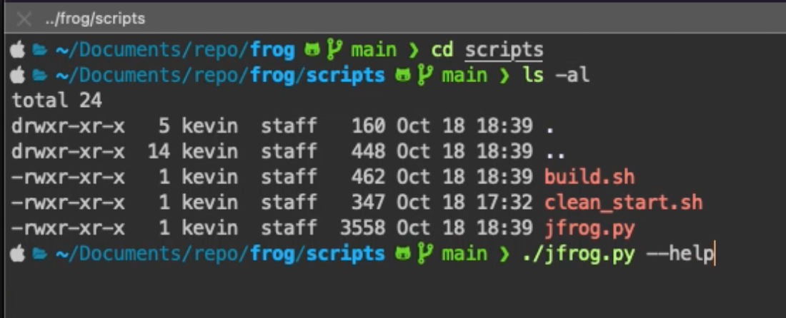
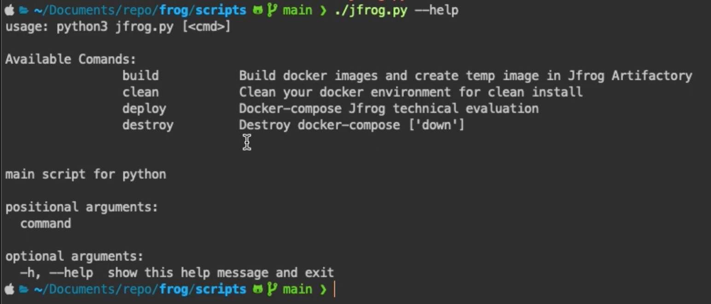
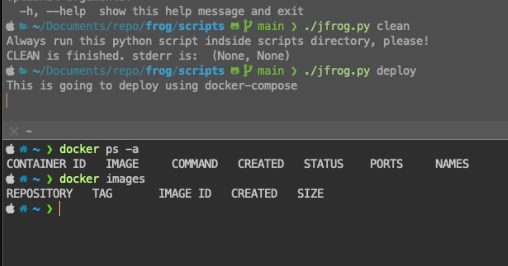
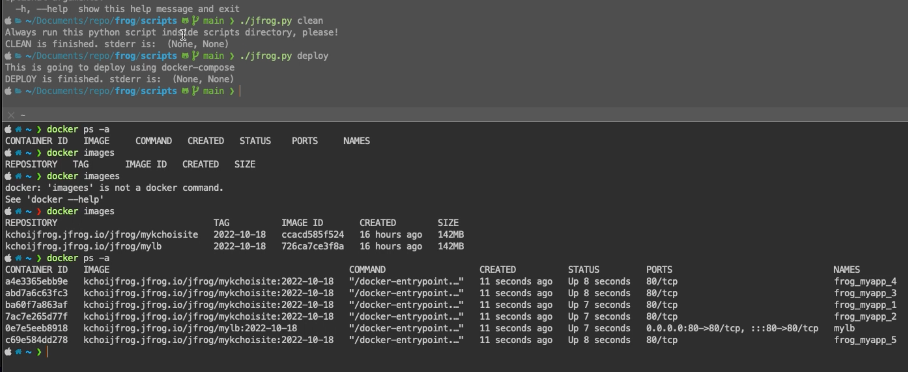
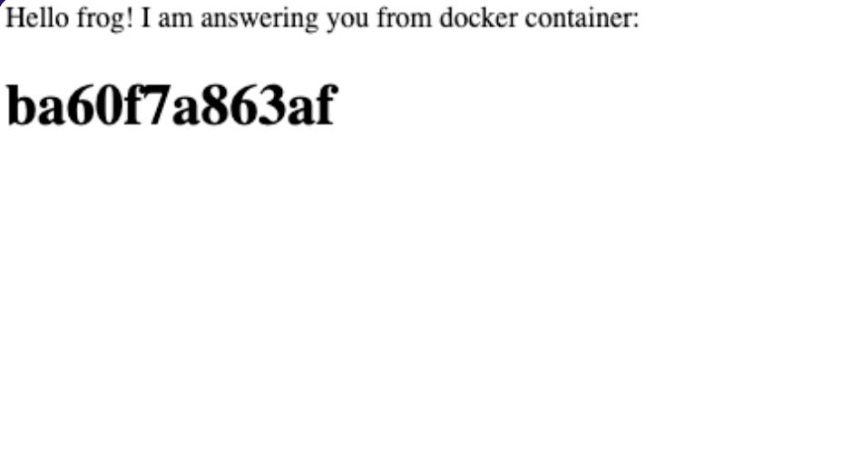
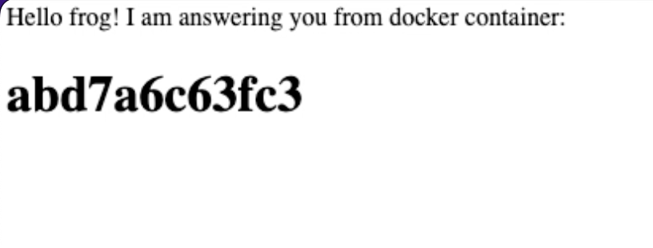
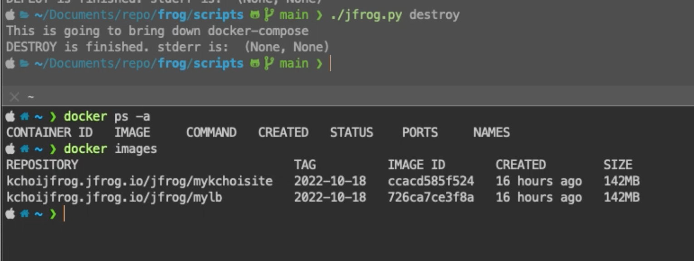
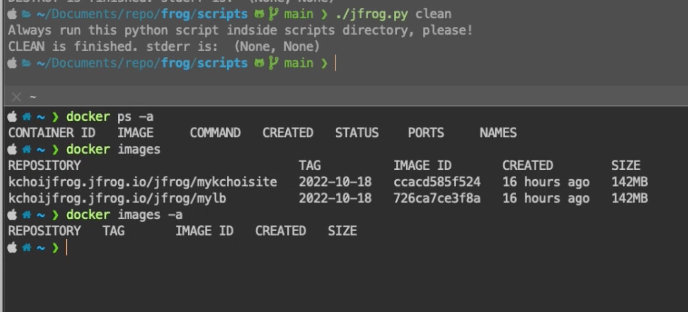

# Kevin Choi - JFrog Production Engineering
## Home Assignment
### Provisioning Alternative 2: Docker-compose
#### Deadline: Oct 20th, 2022
#### Sent by: Niecolle Felix
<br>
<hr>

## Before you start
<p>Run the following commands in your prefered terminal: </p>

```
git clone git@github.com:kchoi123/frog.git

cd frog/scripts

chmod u+x build.sh clean_start.sh
chmod 755 jfrog.py

export API_KEY={api key will be provided}
```

⚠️ WARNING

> This project has only been tested on <b><u>macOS Monterey with Intel Chip</u></b>.

<br>
<p>Commands in this repo can vary depending on macOS M1 chips and Windows versions. Virtualenv can be a way of standardizing and can be developed in the future.</p>
<br>
<hr>

## How to start services
<p>Please run the following commands</p>

```
cd frog/scripts
```

⚠️ WARNING
> Plese remember to run the jfrog.py python script inside the scripts directory.

<br>

```
./jfrog.py --help
usage: python3 jfrog.py [<cmd>]

Available Comands:
                build           Build docker images and create temp image in Jfrog Artifactory
                clean           Clean your docker environment for clean install
                deploy          Docker-compose Jfrog technical evaluation
                destroy         Destroy docker-compose ['down']


main script for python

positional arguments:
  command

optional arguments:
  -h, --help  show this help message and exit
```

```
./jfrog.py clean

./jfrog.py deploy
```
<p>The python 'deploy' command will run docker-compose. The current yaml file has replica set to 5.</p>
<br>
<hr>

## What you should see
<p>Video is in .mov format. Availble to watch on this repository. </p>

[ 

<br>

  

> Navigating to the scripts directory and validating commands.

<br>

  

> Run the clean command then deploy. Validate containers are up and images pulled from JFrog Artifactory.

<br>

  

> Validate with browser and check different hostnames

<br>

  

> Run the destroy command and validate that all containers have been stopped and removed